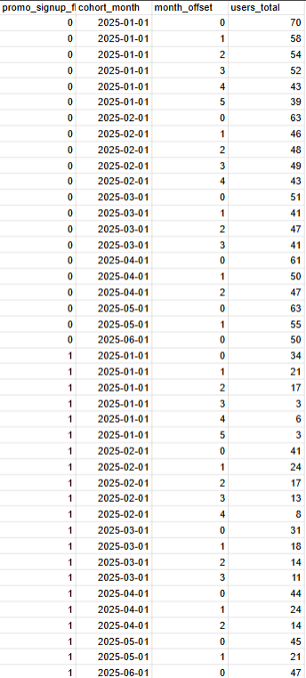
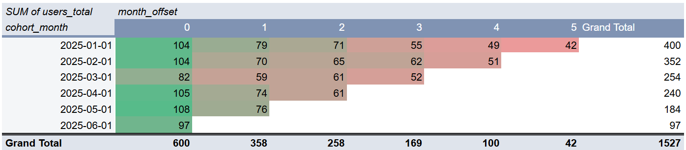
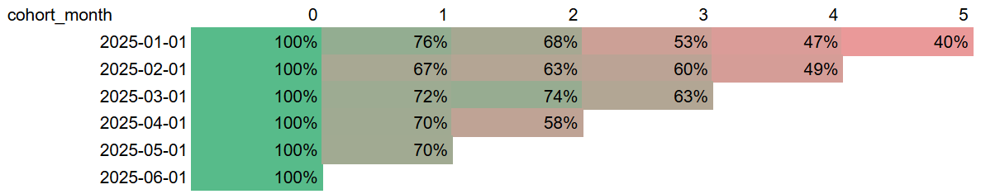

# 📊 User Retention Cohort Analysis

Measuring User Retention Rate Using Google Sheets and SQL Based on Cohort Analysis.

## 🔗 Live Workbook

[Open the project in Google Sheets](https://docs.google.com/spreadsheets/d/1kVXDS0DLoO0HpOCcLSzX4JYC1ncUn57ewwwBlXoGwko)

## 📌 Project Overview

This project demonstrates how SQL and Google Sheets can be used together to evaluate User Retention Rate using Cohort Analysis.
The analysis focuses on understanding how different user acquisition channels affect long-term user engagement.
The project covers the complete analytical workflow:
-Data Cleaning
-Data Transformation
-SQL Analysis
-Cohort Calculation
-Google Sheets Visualization
-Business Insights

## 🎯 Business Problem

User acquisition is expensive.
Marketing teams need to understand:
"Which acquisition channels attract users that remain active over time?"
To answer this question, user cohorts were created based on their registration month and their activity was tracked during the following months.

## 🛠 Tools & Technologies

-SQL
-PostgreSQL
-DBeaver
-Google Sheets
-Pivot Tables
-Cohort Analysis
-Retention Analysis

## 📊 Metrics

The project focuses on evaluating user retention and acquisition quality using cohort analysis.
The following metrics were calculated:
-Users Total – Number of unique users in each cohort.
-Cohort Month – User registration month.
-Activity Month – Month when the user performed an event.
-Month Offset – Number of months since registration.
-Retention Rate (%) – Percentage of active users compared to the original cohort size.
-Promo Signup Flag – User acquisition type (Promo vs Organic).

## 🔍 Analysis Process

The analysis was performed in several stages:
1.Explored raw user and event tables.
2.Cleaned inconsistent date formats using SQL.
3.Converted text-based dates into SQL DATE format.
4.Joined user and event datasets.
5.Calculated cohort month and activity month.
6.Computed the month offset for each user event.
7.Aggregated users by cohort and activity month.
8.Exported the processed dataset to Google Sheets.
9.Built cohort tables using Pivot Tables.
10.Calculated Retention Rate for each cohort.
11.Compared Organic and Promo user retention.
12.Prepared business conclusions and recommendations.

## 🔄 Project Workflow

Raw Data
      │
      ▼
Data Cleaning
      │
      ▼
Date Parsing
      │
      ▼
JOIN
      │
      ▼
Calculate Cohort Month
      │
      ▼
Calculate Month Offset
      │
      ▼
Aggregation
      │
      ▼
Export CSV
      │
      ▼
Google Sheets
      │
      ▼
Pivot Table
      │
      ▼
Retention Rate
      │
      ▼
Business Insights

## 📈 Dashboard Preview

 SQL Output

The dataset below represents the final SQL query output after cleaning, transforming, and aggregating the raw data. It contains the cohort month, month offset, promotion flag, and the total number of users for each cohort.

 Cohort Table

The cohort table summarizes the number of active users for each monthly cohort across six months. It provides an overview of user activity over time and serves as the foundation for retention analysis.

 Retention Rate Heatmap

The retention heatmap visualizes the percentage of users who remained active in each month after registration. The color scale highlights retention trends across cohorts, making it easy to identify user engagement patterns over time.

## 📈 Key Findings

The cohort analysis revealed several important insights:
-Organic users consistently showed higher long-term retention than Promo users.
-Promo campaigns generated a higher number of registrations but lower user retention over time.
-The largest drop in user activity occurred after the first month.
-Users retained after the second month were significantly more likely to remain active in subsequent months.
-Cohort analysis provided clear visibility into user lifecycle and acquisition quality.

## 💼 Business Recommendations

Based on the analysis, the following actions are recommended:
-Invest more in acquisition channels with higher long-term retention.
-Optimize promotional campaigns to improve user engagement after registration.
-Introduce onboarding and activation campaigns during the first month to reduce early churn.
-Continuously monitor retention trends for newly acquired cohorts.
-Use cohort analysis as a recurring KPI for evaluating marketing performance.

## 🚀 Skills Demonstrated

SQL

-Common Table Expressions (CTE)
-Data Cleaning
-Date Parsing
-CASE WHEN
-JOIN
-Aggregation
-GROUP BY
-Date Functions
-Cohort Calculation

Google Sheets

-Pivot Tables
-Conditional Formatting
-Interactive Slicers
-Retention Calculations
-Business Reporting

Data Analytics

-Cohort Analysis
-Retention Analysis
-User Behavior Analysis
-Acquisition Analysis
-Marketing Performance Analysis
-Business Insight Generation

## ⭐ Project Highlights

✔ Cleaned and standardized inconsistent raw data

✔ Calculated monthly user cohorts

✔ Built cohort-based retention analysis

✔ Compared Organic and Promo acquisition channels

✔ Created interactive reports in Google Sheets

✔ Generated actionable business recommendations

